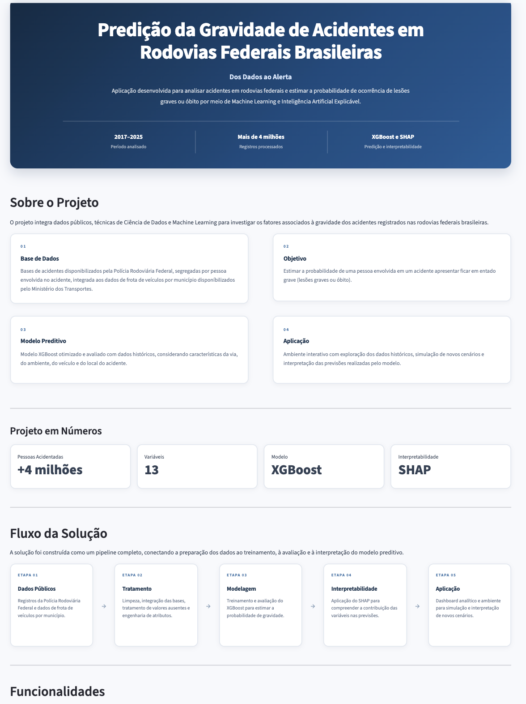
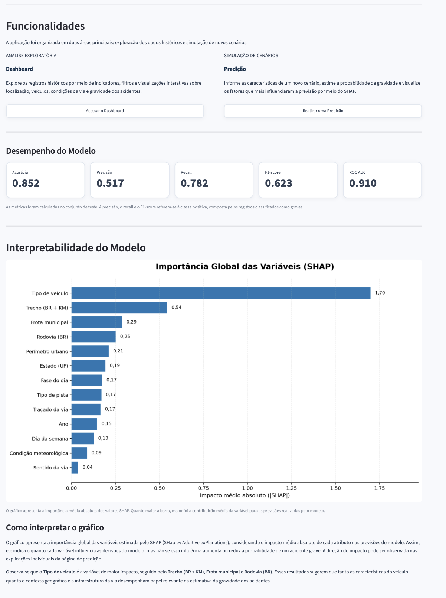
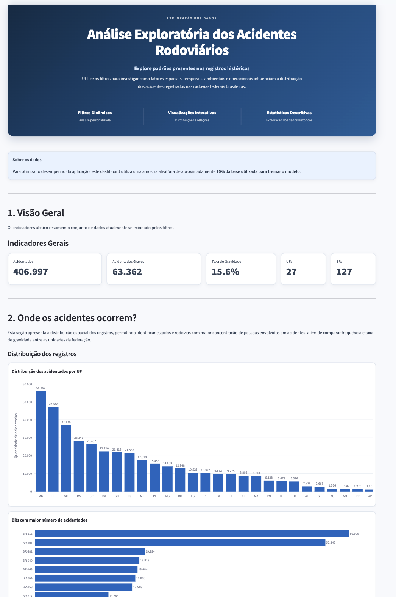
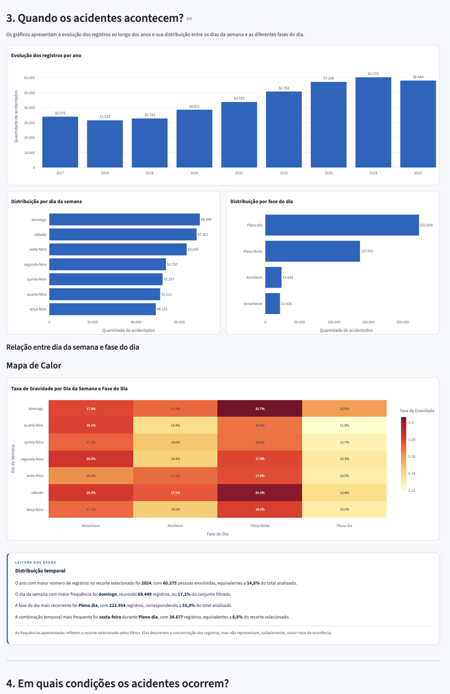
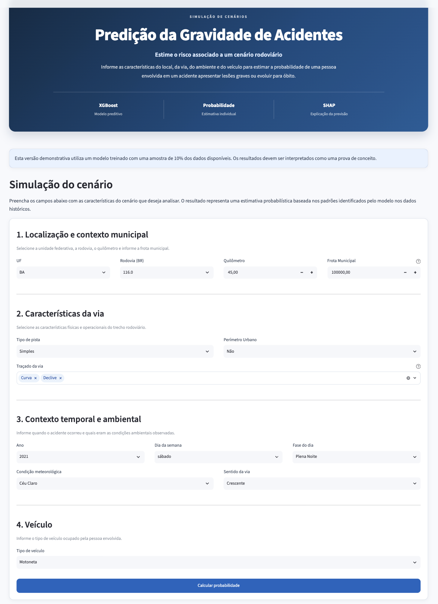
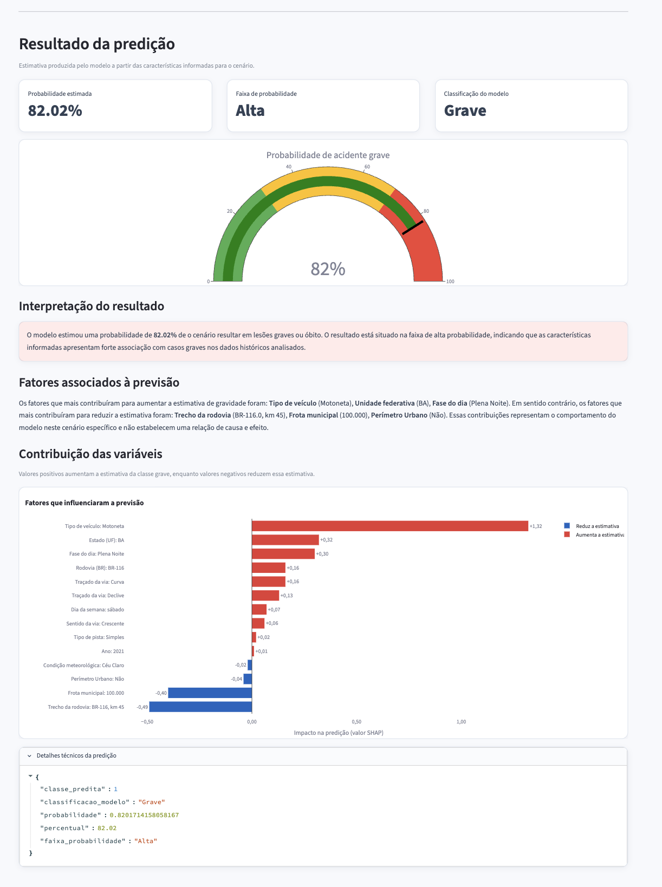
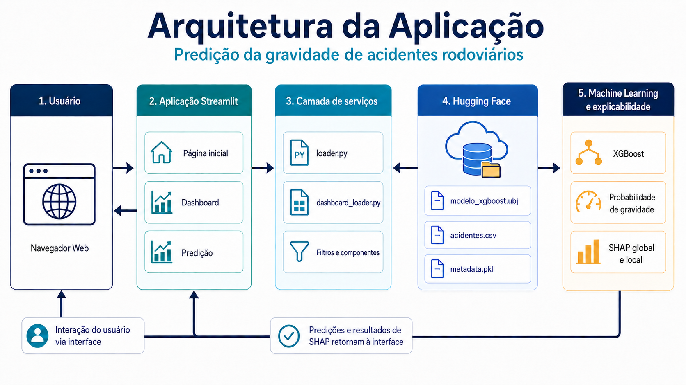

<div align="center">

# 🚧 Predição de Gravidade de Acidentes Rodoviários

### Aplicação Web para análise e predição de acidentes em rodovias federais brasileiras utilizando Machine Learning


</div>

---

# Sobre o projeto

Esta aplicação foi desenvolvida como parte do Trabalho de Conclusão de Curso (TCC) em **Ciência de Dados para Negócios**.

O objetivo é disponibilizar uma interface interativa capaz de:

- explorar indicadores de acidentes rodoviários;
- realizar análises por filtros;
- estimar a probabilidade de um acidente resultar em lesões graves ou óbito;
- interpretar as previsões utilizando Inteligência Artificial Explicável (XAI).

O modelo foi treinado utilizando dados públicos da Polícia Rodoviária Federal (PRF) e dados de frota do Ministério dos Transportes.

---

# Demonstração

```
https://predicaoacidentesapp.streamlit.app/
```

---

# 📸 Aplicação

## Página Inicial

<p align="center">
  
  
</p>

---

## Dashboard

<p align="center">
  
  
</p>

---

## Predição e Explicação SHAP

<p align="center">

<p align="center">
  
  
</p>

</p>

---

# ✨ Funcionalidades

## Dashboard

- Indicadores gerais
- Estatísticas dos acidentes
- Filtros dinâmicos
- Visualizações interativas
- Exploração dos dados

---

## Predição

Permite informar características do acidente, como:

- UF
- Rodovia
- Quilômetro
- Frota do município
- Tipo de pista
- Traçado da via
- Perimetro urbano
- Ano
- Dia da Semana
- Fase do dia
- Condições meteorológicas
- Sentido da via
- Tipo de veículo

e obter:

- Classe prevista
- Probabilidade de gravidade
- Interpretação SHAP da previsão

---

# 🧠 Modelo de Machine Learning

Modelo utilizado:

**XGBoost Classifier**

Variável alvo:

| Classe | Significado |
|---------|-------------|
| 0 | Sem lesões graves |
| 1 | Lesões graves ou óbito |

---

# 📊 Base de dados

Fontes utilizadas:

- Polícia Rodoviária Federal (PRF)
- Ministério dos Transportes (Senatran)

Período:

**2017–2025**

Os dados utilizados são públicos.

---

# 🏗 Arquitetura

<p align="center">



</p>

---

# 📁 Estrutura do projeto

```text
predicao_acidentes_app/

├── .streamlit/
│   └── config.toml
│
├── app.py
├── config.py
├── requirements.txt
├── README.md
│
├── assets/
│   ├── css/
│   └── images/
│
├── components/
│   ├── ...
│
├── pages/
│   ├── home.py
│   ├── dashboard.py
│   └── predict.py
│
└── services/
    ├── loader.py
    ├── predictor.py
    ├── dashboard_loader.py
    ├── feature_engineering.py
    └── explainer.py
```

---

# 🛠 Tecnologias

| Tecnologia | Finalidade |
|------------|------------|
| Python | Linguagem principal |
| Streamlit | Interface Web |
| Pandas | Manipulação dos dados |
| NumPy | Operações numéricas |
| Plotly | Visualizações |
| XGBoost | Modelo preditivo |
| SHAP | Interpretabilidade |
|Hugging Face Hub | Hospedagem do modelo e dos artefatos |
| Joblib | Persistência do modelo |

---

# ⚙️ Instalação

Clone o projeto

```bash
git clone https://github.com/SEU_USUARIO/predicao_acidentes_app.git

cd predicao_acidentes_app
```

Crie um ambiente virtual

```bash
python -m venv venv
```

Windows

```bash
venv\Scripts\activate
```

macOS/Linux

```bash
source venv/bin/activate
```

Instale as dependências

```bash
pip install -r requirements.txt
```

---

# ▶️ Executando

```bash
streamlit run app.py
```

---

# 📂 Repositório de treinamento

O treinamento do modelo, preparação dos dados e geração das interpretações SHAP estão disponíveis em um repositório separado.

*[Predição de Gravidade de Acidentes Rodoviários — Machine Learning](https://github.com/elainerreis/predicao_acidentes_rodoviarios)*

---

# 🗺 Roadmap

- [x] ETL dos dados
- [x] Engenharia de atributos
- [x] Treinamento do modelo
- [x] Avaliação
- [x] Explicabilidade com SHAP
- [x] Aplicação Streamlit
- [x] Deploy público

---

# 👩‍💻 Autora

**Elaine Regina Reis Sousa**

Graduanda em Ciência de Dados para Negócios

LinkedIn: *[https://www.linkedin.com/in/elainerreiss](https://www.linkedin.com/in/elainerreiss-131a52202/)*

---

# 📄 Licença

Projeto desenvolvido para fins acadêmicos como Trabalho de Conclusão de Curso.

Os dados utilizados são públicos e pertencem aos respectivos órgãos governamentais.
# predicao_acidentes_app
